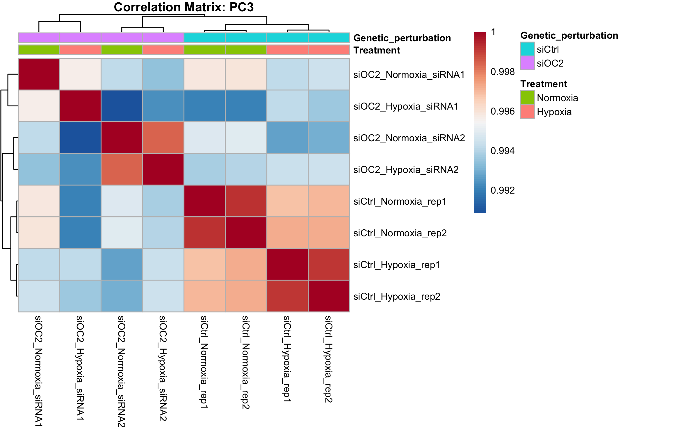
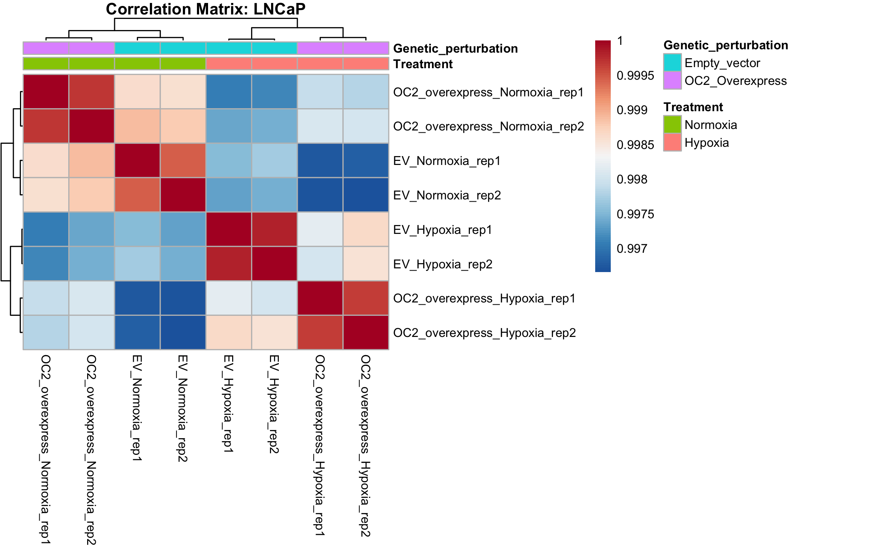
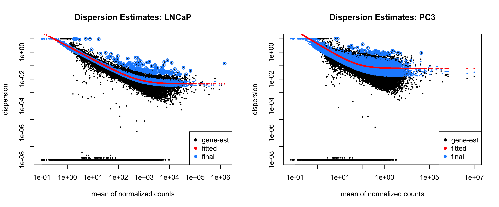
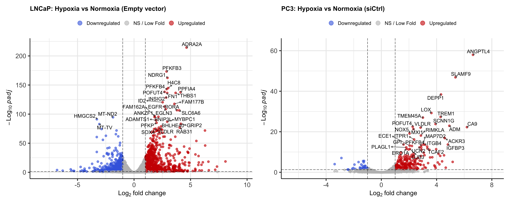
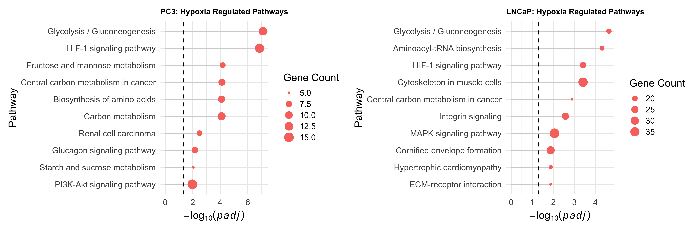
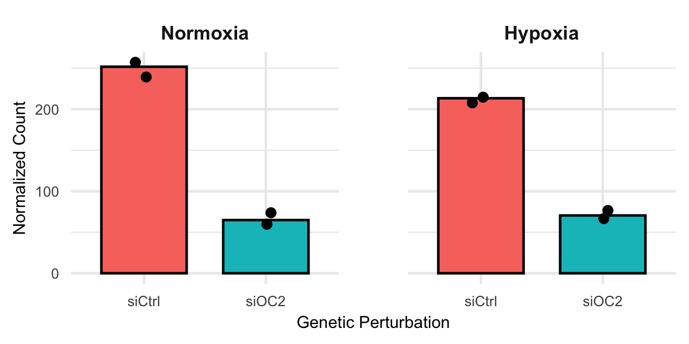
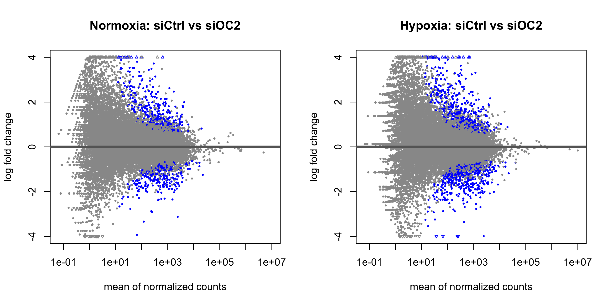
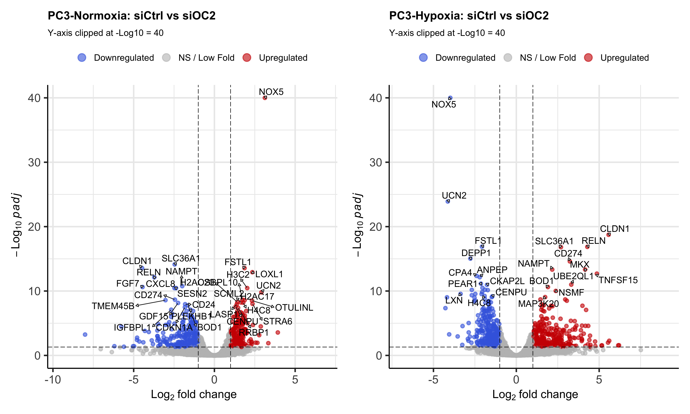

# Differential Gene expression analysis using Deseq2
Nitin Beesabathuni
2026-02-08

- [1. Data Import and Metadata
  Preparation](#1-data-import-and-metadata-preparation)
- [2. Data QC for any technical
  artifacts](#2-data-qc-for-any-technical-artifacts)
- [3. Differential expression analysis using
  Deseq2](#3-differential-expression-analysis-using-deseq2)
- [4. Deferentially expressed genes under hypoxia
  condition](#4-deferentially-expressed-genes-under-hypoxia-condition)
- [5. Role of OC2 gene under hypoxia
  conditions](#5-role-of-oc2-gene-under-hypoxia-conditions)

In this analysis, we walk through a differential gene expression
workflow using DESeq2 to study transcriptional changes under hypoxic
conditions and to evaluate the effects of OC2 overexpression in LNCaP
cells and OC2 knockdown in PC3 cells. The goal is not only to identify
differentially expressed genes, but also to demonstrate how to evaluate
data quality, interpret model behavior, and assess biological
plausibility at each step.

<details class="code-fold">
<summary>Code</summary>

``` r
# Load necessary library
library(tidyverse)
library(here)
library(conflicted)
library(DESeq2)
library(ggplot2)
library(ggpubr) 
library(scales) # For readable axis labels
library(gt)
library(DESeq2)
library(pheatmap)
library(RColorBrewer)
library(patchwork)
library(ggplotify)
library(patchwork)
library(org.Hs.eg.db)
# Resolve namespace conflicts
conflict_prefer("select", "dplyr")
conflict_prefer("filter", "dplyr")
conflicts_prefer(generics::setdiff)

#loading functions
source(here("scripts","functions.R"))
```

</details>

## 1. Data Import and Metadata Preparation

We begin by importing an annotated gene-level count matrix, using gene
symbols as primary identifiers. Sample metadata are constructed to
explicitly encode treatment condition and genetic perturbation status,
as these variables will later define the design matrix used by DESeq2.
Careful metadata preparation at this stage is critical, as all
downstream modeling relies on the correctness of these annotations.

<details class="code-fold">
<summary>Code</summary>

``` r
# Loading cleaned and annotated data for both cell types
data <- read.csv(here("data","analysis_ready_count_data.csv"), row.names = 1, check.names = FALSE)

#Separting data for both cell types into their respective dfs

data_lncap <- data %>%
  select(contains("LNCaP"))

data_pc3 <- data %>%
  select(contains("PC3"))

# 1. Sanitize the column names of your dataframes immediately
# This replaces dashes or illegal characters with dots (e.g., rep-1 becomes rep.1)
colnames(data_lncap) <- make.names(colnames(data_lncap))
colnames(data_pc3) <- make.names(colnames(data_pc3))

# 2. Define the metadata vectors
condition <- c(rep("Normoxia", 4), rep("Hypoxia", 4))
overexpress <- c(rep("Empty_vector", 2), rep("OC2_Overexpress", 2), 
                 rep("Empty_vector", 2), rep("OC2_Overexpress", 2))
knockdown <- c(rep("siCtrl", 2), rep("siOC2", 2), 
               rep("siCtrl", 2), rep("siOC2", 2))

# 3. Create the data frames with explicit row names from the sanitized columns
# We also use stringsAsFactors = TRUE or explicitly wrap in factor() for DESeq2
meta_lncap <- data.frame(
  Treatment = factor(condition, levels = c("Normoxia", "Hypoxia" )),
  Genetic_perturbation = factor(overexpress, levels = c("Empty_vector", "OC2_Overexpress")),
  row.names = colnames(data_lncap) 
)

meta_pc3 <- data.frame(
  Treatment = factor(condition, levels = c("Normoxia", "Hypoxia")),
  Genetic_perturbation = factor(knockdown, levels = c("siCtrl", "siOC2")),
  row.names = colnames(data_pc3)
)

# CRITICAL CHECK: DESeq2 will fail if these are not identical
stopifnot(all(colnames(data_lncap) == rownames(meta_lncap)))
stopifnot(all(colnames(data_pc3) == rownames(meta_pc3)))
```

</details>

## 2. Data QC for any technical artifacts

Before performing differential expression analysis, it is essential to
assess whether technical artifacts or outlier samples are present. While
replicate correlations at the count level provide a useful first check,
high-dimensional methods such as principal component analysis (PCA) and
hierarchical clustering offer deeper insight into global sample
relationships.

<details class="code-fold">
<summary>Code</summary>

``` r
##defining deseq2 object
dds_pc3<- DESeqDataSetFromMatrix(countData = data_pc3,
                              colData = meta_pc3,
                              design = ~Treatment*Genetic_perturbation)   
dds_lncap<- DESeqDataSetFromMatrix(countData = data_lncap,
                              colData = meta_lncap,
                              design = ~Treatment*Genetic_perturbation) 
# For PC3
pc3_QC<-QC_pca_heatmap(dds_pc3, meta_pc3,cell_line_name = "PC3")
```

</details>

    using ntop=500 top features by variance

<details class="code-fold">
<summary>Code</summary>

``` r
# For LNCaP
lncap_QC<-QC_pca_heatmap(dds_lncap, meta_lncap,cell_line_name = "LNCaP")
```

</details>

    using ntop=500 top features by variance

<details class="code-fold">
<summary>Code</summary>

``` r
#PCA for both the cell lines across two treatments and genetic perturbations. 
lncap_QC$pca+ pc3_QC$pca 
```

</details>


***Figure 1:** Principal component analysis for LNCaP and PC3 samples.
Genetic perturbation is dsiplayed by color and Treatment condition is
displayed by different symbols.*

For LNCaP samples, PCA reveals four well-separated clusters
corresponding to the combination of treatment condition and genetic
perturbation. The first principal component (PC1), which explains
approximately 56% of the total variance, primarily captures treatment
effects. The second principal component (PC2), explaining approximately
37% of the variance, reflects the impact of OC2 overexpression. The
absence of isolated samples or unexpected clustering patterns suggests
that these data are free of major technical artifacts and suitable for
downstream modeling.

PC3 samples exhibit a different structure. PCA shows a strong separation
between siCtrl and siOC2 conditions; however, within the siOC2 group,
samples further separate into two distinct clusters- not based on the
treatment. This suggesting the presence of an additional latent
variable. To investigate this further, lets examine sample correlation
using heatmaps.

<details class="code-fold">
<summary>Code</summary>

``` r
#heatmap for pc3 cells
pc3_QC$heatmap
```

</details>



***Figure 2:** Heatmap of correlation matrix between samples for PC3
cell line. Correlation is measured using pearson correlation metric.*

Based on the heatmap, we see another latent variable- the siRNA used. We
can see the siRNA specific samples cluster more strongly together
regardless of the treatment. If treatment effects dominate global
expression variance, we would expect the siRNA1 and siRNA2 to cluster
together based on the treatment. However, we see a stronger correlation
between the same siRNA’s used for knockdown of OC2 regardless of the
treatment. This could perhaps be a result of knockdown of OC2 which
rescues some aspects of hypoxia driven cellular changes (not fully).
However, we also see the siRNA’s under normoxia cluster separately so
there could be some off target activity of the specific siRNA used to
knockdown OC2.

<details class="code-fold">
<summary>Code</summary>

``` r
#heatmap for lncap cells
lncap_QC$heatmap
```

</details>



***Figure 3:** Heatmap of correlation matrix between samples for LNCaP
cell line. Correlation is measured using pearson correlation metric.*

For LNCaP cells, the replicates cluster together based on the treatment
and genetic perturbation as expected. Next, lets perform differential
expression analysis using Deseq2 to ask various questions.

## 3. Differential expression analysis using Deseq2

With data quality assessed, we proceed to differential expression
analysis using DESeq2. Reference levels are set such that normoxia and
control genetic perturbations (empty vector or siCtrl) serve as baseline
conditions. Calling the `DESeq()` function initiates a sequence of
modeling steps, which are outlined below to clarify how DESeq2 arrives
at its final statistical tests.

<details class="code-fold">
<summary>Code</summary>

``` r
#
#releveling to set reference for treatment and perturbation
dds_pc3$Treatment <- relevel(dds_pc3$Treatment, ref = "Normoxia")
dds_pc3$Genetic_perturbation <- relevel(dds_pc3$Genetic_perturbation, ref = "siCtrl")
  
dds_lncap$Treatment <- relevel(dds_lncap$Treatment, ref = "Normoxia")
dds_lncap$Genetic_perturbation <- relevel(dds_lncap$Genetic_perturbation, ref = "Empty_vector")

dds_lncap <- DESeq(dds_lncap)
```

</details>

    estimating size factors

    estimating dispersions

    gene-wise dispersion estimates

    mean-dispersion relationship

    final dispersion estimates

    fitting model and testing

<details class="code-fold">
<summary>Code</summary>

``` r
dds_pc3<-DESeq(dds_pc3)
```

</details>

    estimating size factors

    estimating dispersions

    gene-wise dispersion estimates

    mean-dispersion relationship

    final dispersion estimates

    fitting model and testing

You can see various steps that are performed by this function. Briefly,
the DESeq function performs the following steps-

1\) **estimating size factors**- Estimate sample-specific size factors
using the median-of-ratios method to normalize for sequencing depth and
composition bias.

2\) **estimating dispersions/gene-wise dispersion estimates**- Estimate
gene-wise dispersion parameters under a negative binomial model.

3\) **mean-dispersion relationship**- Fit a mean–dispersion trend across
genes.

4\) **final dispersion estimates**-Calculate the final dispersion
estimates using shrinkage toward the fitted trend.

5\) **fitting model and testing**- Fit a negative binomial generalized
linear model using the specified design matrix and perform hypothesis
testing (Using Wald test here) to identify differentially expressed
genes.

Now, lets examine the mean-dispersion plot to check how well our
assumptions hold and

<details class="code-fold">
<summary>Code</summary>

``` r
# Set the graphics device to 1 row and 2 columns
par(mfrow = c(1, 2))

# Plot for LNCaP with a custom title
plotDispEsts(dds_lncap, main = "Dispersion Estimates: LNCaP")

# Plot for PC3 with a custom title
plotDispEsts(dds_pc3, main = "Dispersion Estimates: PC3")
```

</details>



***Figure 4:** Dispersion estimates for both cell lines using Deseq2
package. Each dot represents a gene.*

The fit looks good. We can see the fitted (Red) smoothly follows the
data points and shrinkage in dispersion (blue dots) towards fitted curve
nicely. Also, notice a nice downward trend in dispersion as mean
increases. We can also observe some final dispersion and estimated
values perfectly overlap, these are genes that are not shrunk towards
the fitted line.

<details class="code-fold">
<summary>Code</summary>

``` r
# Reset the graphics device to default (1x1)
par(mfrow = c(1, 1))

#lets understand the genes that are differential expressed under hypoxia condition. 
# PC3: Hypoxia vs Normoxia (within siCtrl)
res_pc3_hypoxia <- results(dds_pc3, 
                           contrast = c("Treatment", "Hypoxia", "Normoxia"))

# LNCaP: Hypoxia vs Normoxia (within empty vector)
res_lncap_hypoxia <- results(dds_lncap, 
                             contrast = c("Treatment", "Hypoxia", "Normoxia"))
```

</details>

Before focusing on individual differentially expressed genes (DEGs),
lets also xamine the relationship between normalized counts and
estimated fold changes to ensure that model estimates behave sensibly
across the expression range.

<details class="code-fold">
<summary>Code</summary>

``` r
# 1. Prepare the grid (1 row, 2 columns)
par(mfrow = c(1, 2))

# 2. Call the plots directly
plotMA(res_lncap_hypoxia, ylim = c(-4, 4), alpha = 0.05,main = "LNCaP: Hypoxia vs Normoxia (Empty Vector)")
plotMA(res_pc3_hypoxia, ylim = c(-4, 4), alpha = 0.05,main = "PC3: Hypoxia vs Normoxia (siCtrls)")
```

</details>


<details class="code-fold">
<summary>Code</summary>

``` r
# 3. Reset to default (1x1)
par(mfrow = c(1, 1))
```

</details>

***Figure 5:** MA plot for both cell lines. Each dot represents a gene
and differential expressed genes between normoxia and hypoxia conditions
for empty vector and siCtrl for LNCaP and PC3 Cells, respectively with
padj\<0.05 are shown in blue.*

Overall, we identify a larger number of DEGs in LNCaP cells compared to
PC3 cells. This difference may reflect biological differences between
the cell lines, differences in variability across samples, or latent
technical factors.

## 4. Deferentially expressed genes under hypoxia condition

<details class="code-fold">
<summary>Code</summary>

``` r
# Generate plots for both cell lines
v_pc3 <- plot_volcano(res_pc3_hypoxia, "PC3: Hypoxia vs Normoxia (siCtrl)",p_clip = 1e-50)
```

</details>

    Warning: Using `size` aesthetic for lines was deprecated in ggplot2 3.4.0.
    ℹ Please use `linewidth` instead.
    ℹ The deprecated feature was likely used in the EnhancedVolcano package.
      Please report the issue to the authors.

    Warning: The `size` argument of `element_line()` is deprecated as of ggplot2 3.4.0.
    ℹ Please use the `linewidth` argument instead.
    ℹ The deprecated feature was likely used in the EnhancedVolcano package.
      Please report the issue to the authors.

<details class="code-fold">
<summary>Code</summary>

``` r
v_lncap <- plot_volcano(res_lncap_hypoxia, "LNCaP: Hypoxia vs Normoxia (Empty vector)",p_clip = 1e-50)

# Display side-by-side
 v_lncap+v_pc3
```

</details>

    Warning: ggrepel: 17 unlabeled data points (too many overlaps). Consider
    increasing max.overlaps

    Warning: ggrepel: 2 unlabeled data points (too many overlaps). Consider
    increasing max.overlaps



***Figure 6:** Volcano plot displaying DEGs between normoxia and hypoxia
conditions for empty vector and siCtrl for LNCaP and PC3 Cells,
respectively. Fold change of 2 and with padj of 0.05 were used as
thresholds.*

We can see some a good number of genes that are differential expressed.
For PC3 samples, we can see some well known genes regulated under
hypoxic conditions such as ANGPTL4 and NDRG1. Lets do a sanity check for
the differential expressed genes are consistent with the known biology.
Lets perform pathway enrichment on these DEGs to understand the pathways
regulated. For additional confirmation at a global scale of all the
DEGs, lets perform pathway enrichment analysis to identify if the known
pathways are identified.

<details class="code-fold">
<summary>Code</summary>

``` r
# extract entrezids from gene symbols
get_sig_genes <- function(res) {
  # Filter for padj < 0.05 and |LFC| > 1
  sig <- subset(res, padj < 0.05 & abs(log2FoldChange) > 1)
  
  # Convert Gene Symbols (rownames) to Entrez IDs
  ids <- bitr(rownames(sig), fromType = "SYMBOL", 
              toType = "ENTREZID", OrgDb = org.Hs.eg.db)
  return(ids$ENTREZID)
}

genes_pc3 <- get_sig_genes(res_pc3_hypoxia)
genes_lncap <- get_sig_genes(res_lncap_hypoxia)

pc3_kegg<-plot_kegg_pathways(genes_pc3, "PC3: Hypoxia Regulated Pathways", p_cutoff = 0.05, max_pathways = 10)

# For LNCaP
lncap_kegg<-plot_kegg_pathways(genes_lncap, "LNCaP: Hypoxia Regulated Pathways", p_cutoff = 0.05, max_pathways = 10)

lncap_kegg+pc3_kegg
```

</details>



***Figure 7: Functional enrichment of hypoxia-responsive genes.** Plots
displaying KEGG pathway enrichment analysis of DEGs between normoxia and
hypoxia. Comparisons were performed in control samples: Empty Vector for
LNCaP and siCtrl for PC3. Statistical significance is represented as
-log10(padj).*

We can observe Glycolysis and HIF-1 signaling pathways pop up which are
some of the well known pathways regulated under under hypoxia
conditions. This provides additional validation for the analysis.

## 5. Role of OC2 gene under hypoxia conditions

To understand the role of OC2 gene and the mechanism of action under
hypoxia conditions, lets first analyze PC3 samples where OC2 is knocked
down. Lets first sanity check if we observe a decrease in PC3
transcripts

<details class="code-fold">
<summary>Code</summary>

``` r
# 1. Extract normalized counts for a specific gene (e.g., AAMP)
gene_name <- "ONECUT2"
plot_data <- plotCounts(dds_pc3, gene = gene_name, intgroup = c("Treatment", "Genetic_perturbation"), returnData = TRUE)

# 2. Add a column for Sample Names (the x-axis)
plot_data$Sample <- rownames(plot_data)

ggplot(plot_data, aes(x = Genetic_perturbation, y = count, fill = Genetic_perturbation)) +
  # This groups Normoxia and Hypoxia into separate, adjacent panels
  facet_wrap(~Treatment) + 
  # Using 'summary' to show the mean height of the replicates
  geom_bar(stat = "summary", fun = "mean", color = "black", width = 0.7) +
  # Adding individual points to show the actual replicate values (important for QC)
  geom_point(position = position_jitter(width = 0.1), color = "black") +
  theme_minimal() +
  labs(
    x = "Genetic Perturbation",
    y = "Normalized Count",
    fill = "Group"
  ) +
  theme(
    legend.position = "none",
    strip.text = element_text(face = "bold", size = 8), 
    axis.title = element_text(size = 7),
    axis.text = element_text(size = 6),
    panel.spacing = unit(2, "lines") # Adds space between the two panels
  )
```

</details>



***Figure 8:** ONECUT2 (OC2) expression in PC3 samples. Normalized count
shown on x-axis. Rep1/ rep2 for siCtrl and two guides for siOC2 as shown
as for siOC2 samples.*

We can notice a strong reduction (5X) in siOC2 transcripts compared to
siCtrl in both treatment groups. Lets analyze the genes and pathways
modulated by siOC2 knockdown.

<details class="code-fold">
<summary>Code</summary>

``` r
res_OC2_normoxia <- results(dds_pc3, 
                           contrast = c("Genetic_perturbation", "siCtrl", "siOC2"))

# Effect of siOC2 compared to siCtrl specifically in Hypoxia
res_OC2_Hypoxia <- results(dds_pc3, 
                             contrast = list(c("Genetic_perturbation_siOC2_vs_siCtrl", 
                                               "TreatmentHypoxia.Genetic_perturbationsiOC2")))
```

</details>

<details class="code-fold">
<summary>Code</summary>

``` r
# 1. Prepare the grid (1 row, 2 columns)
par(mfrow = c(1, 2))

# 2. Call the plots directly
plotMA(res_OC2_normoxia, ylim = c(-4, 4), alpha = 0.05,main = "Normoxia: siCtrl vs siOC2")
plotMA(res_OC2_Hypoxia, ylim = c(-4, 4), alpha = 0.05,main = "Hypoxia: siCtrl vs siOC2")
```

</details>



<details class="code-fold">
<summary>Code</summary>

``` r
# 3. Reset to default (1x1)
par(mfrow = c(1, 1))
```

</details>

Lets plot volcano plots

<details class="code-fold">
<summary>Code</summary>

``` r
# Generate plots for both cell lines
norm_sioc2 <- plot_volcano(res_OC2_normoxia, "PC3-Normoxia: siCtrl vs siOC2")
hypox_sioc2 <- plot_volcano(res_OC2_Hypoxia, "PC3-Hypoxia: siCtrl vs siOC2")

# Display side-by-side
norm_sioc2+hypox_sioc2
```

</details>

    Warning: ggrepel: 8 unlabeled data points (too many overlaps). Consider
    increasing max.overlaps


