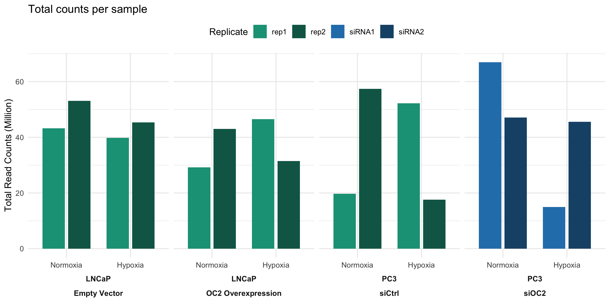
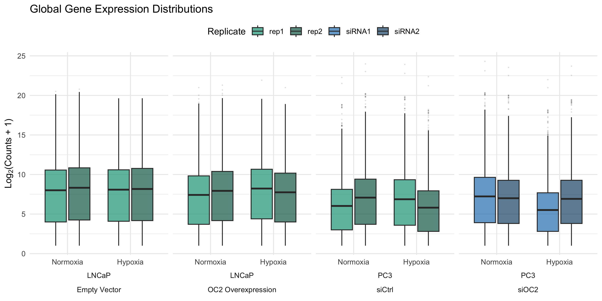
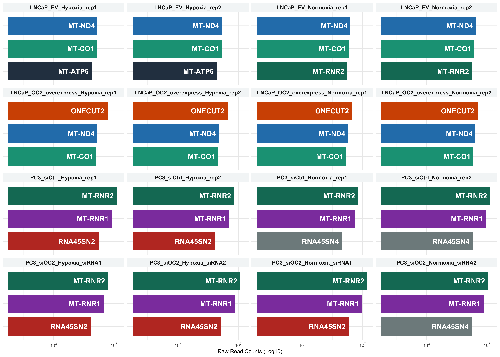
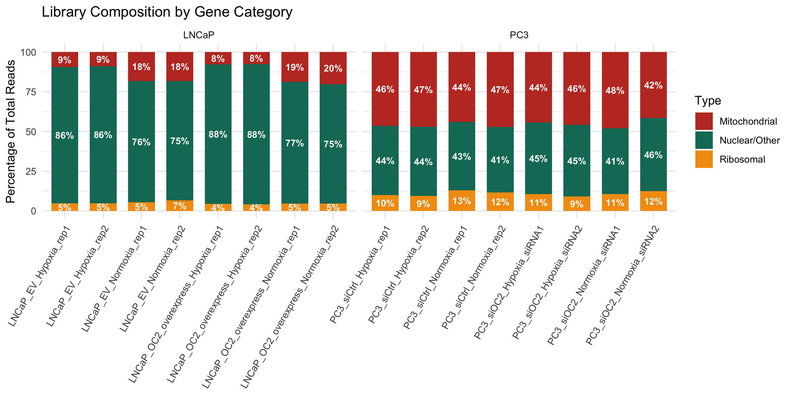

# Quality Control and Library Composition Analysis
Nitin Beesabathuni
2026-02-08

- [1. Data Import and Preparation](#1-data-import-and-preparation)
- [2. Sequencing Depth & Replicate
  Consistency](#2-sequencing-depth--replicate-consistency)
- [3. Library Composition](#3-library-composition)

Summary: This report details the initial Quality Control (QC) and
exploratory analysis of transcriptomic data from LNCaP and PC3 prostate
cancer cell lines under genetic perturbation
(https://pubmed.ncbi.nlm.nih.gov/30655535/). The goal is to evaluate
sequencing depth and library composition (Mitochondrial vs. Ribosomal
content) across treatment/replicate conditions prior to differential
expression analysis.

<details class="code-fold">
<summary>Code</summary>

``` r
# Load necessary library
library(tidyverse)
library(here)
library(conflicted)
library(DESeq2)
library(ggplot2)
library(ggpubr) 
library(scales) # For readable axis labels
library(gt)
# Resolve namespace conflicts
conflict_prefer("select", "dplyr")
conflict_prefer("filter", "dplyr")
conflicts_prefer(generics::setdiff)
```

</details>

## 1. Data Import and Preparation

Importing the annotated count matrix. Gene symbols are used as primary
identifiers.

<details class="code-fold">
<summary>Code</summary>

``` r
# Loading cleaned and annotated data
# check.names = FALSE ensures sample IDs containing dashes/special characters remain intact
data <- read.csv(here("data","analysis_ready_count_data.csv"), row.names = 1, check.names = FALSE)

# Display data structure
knitr::kable(head(data))
```

</details>

|  | LNCaP_EV_Normoxia_rep1 | LNCaP_EV_Normoxia_rep2 | LNCaP_OC2_overexpress_Normoxia_rep1 | LNCaP_OC2_overexpress_Normoxia_rep2 | LNCaP_EV_Hypoxia_rep1 | LNCaP_EV_Hypoxia_rep2 | LNCaP_OC2_overexpress_Hypoxia_rep1 | LNCaP_OC2_overexpress_Hypoxia_rep2 | PC3_siCtrl_Normoxia_rep1 | PC3_siCtrl_Normoxia_rep2 | PC3_siOC2_Normoxia_siRNA1 | PC3_siOC2_Normoxia_siRNA2 | PC3_siCtrl_Hypoxia_rep1 | PC3_siCtrl_Hypoxia_rep2 | PC3_siOC2_Hypoxia_siRNA1 | PC3_siOC2_Hypoxia_siRNA2 |
|:---|---:|---:|---:|---:|---:|---:|---:|---:|---:|---:|---:|---:|---:|---:|---:|---:|
| A1BG | 96 | 188 | 98 | 118 | 94 | 126 | 135 | 104 | 6 | 5 | 15 | 33 | 5 | 1 | 2 | 12 |
| A2M | 8 | 9 | 7 | 10 | 7 | 7 | 14 | 9 | 8 | 14 | 12 | 10 | 8 | 6 | 3 | 11 |
| NAT1 | 613 | 760 | 399 | 625 | 749 | 1149 | 623 | 522 | 77 | 158 | 169 | 207 | 133 | 45 | 32 | 144 |
| NAT2 | 31 | 34 | 10 | 25 | 29 | 33 | 31 | 22 | 0 | 1 | 7 | 8 | 2 | 0 | 1 | 10 |
| SERPINA3 | 158 | 217 | 60 | 110 | 75 | 55 | 101 | 72 | 5 | 16 | 9 | 6 | 5 | 4 | 0 | 3 |
| AAMP | 2211 | 3305 | 1709 | 2072 | 2324 | 2641 | 1980 | 1366 | 485 | 1144 | 1577 | 1132 | 911 | 281 | 330 | 992 |

<details class="code-fold">
<summary>Code</summary>

``` r
#head(data)%>% gt(rownames_to_stub = TRUE)
```

</details>

## 2. Sequencing Depth & Replicate Consistency

Lets first evaluate the total read counts per sample to identify
potential library size biases.

\#\| fig-cap: “Figure 1: Total library sizes grouped by Cell Line,
Treatment, and Genetic perturbation.”

<details class="code-fold">
<summary>Code</summary>

``` r
lib_size <- data.frame(
  Sample = colnames(data),
  Counts_Millions = colSums(data) / 1e6
) %>%
  mutate(
    Cell_Line = ifelse(str_detect(Sample, "LNCaP"), "LNCaP", "PC3"),
    Condition = factor(ifelse(str_detect(Sample, "Hypoxia"), "Hypoxia", "Normoxia"), 
                       levels = c("Normoxia", "Hypoxia")),
    Replicate = str_extract(Sample, "(rep|siRNA)[1-2]$"),
    Treatment = case_when(
      str_detect(Sample, "EV") ~ "Empty Vector",
      str_detect(Sample, "overexpress") ~ "OC2 Overexpression",
      str_detect(Sample, "siCtrl") ~ "siCtrl",
      str_detect(Sample, "siOC2") ~ "siOC2",
      TRUE ~ "Other"
    )
  )

ggplot(lib_size, aes(x = Condition, y = Counts_Millions, fill = Replicate)) +
  geom_col(position = position_dodge(width = 0.8), width = 0.7) +
  facet_grid(. ~ Cell_Line + Treatment, scales = "free_x", space = "free_x", switch = "x") +
  # Teal gradient for reps, Blue gradient for siRNA to distinguish experimental designs
  scale_fill_manual(values = c("rep1" = "#16A085", "rep2" = "#0E6655", 
                               "siRNA1" = "#2980B9", "siRNA2" = "#1A5276")) +
  theme_minimal() +
  theme(strip.placement = "outside", 
        strip.text = element_text(size = 9, face = "bold"),
        legend.position = "top") +
  labs(title = "Total counts per sample",
       y = "Total Read Counts (Million)", x = NULL)
```

</details>



***Figure 1:** Total library sizes grouped by Cell Line, Treatment, and
Genetic perturbation.*

LNCaP samples show consistent read depths across conditions. Conversly,
PC3 replicates indicate noticeable variability in depth. These
differences in sequencing can be addressed using size-factor
normalization or other normalization methods during differential
expression analysis.

<details class="code-fold">
<summary>Code</summary>

``` r
data_long <- data %>%
  rownames_to_column("Gene") %>%
  pivot_longer(-Gene, names_to = "Sample", values_to = "Counts") %>%
  filter(Counts > 0) %>% 
  left_join(lib_size, by = "Sample")

ggplot(data_long, aes(x = Condition, y = log2(Counts + 1), fill = Replicate)) +
  geom_boxplot(outlier.size = 0.2, alpha = 0.7, outlier.alpha = 0.1) +
  facet_grid(. ~ Cell_Line + Treatment, scales = "free_x", space = "free_x", switch = "x") +
  scale_fill_manual(values = c("rep1" = "#16A085", "rep2" = "#0E6655", 
                               "siRNA1" = "#2980B9", "siRNA2" = "#1A5276")) +
  theme_minimal() +
  theme(strip.placement = "outside", legend.position = "top") +
  labs(title = "Global Gene Expression Distributions",
       y = expression(Log[2] * "(Counts + 1)"), x = NULL)
```

</details>



***Figure 2:** Distribution of Log2-transformed counts.*

Global expression profiles are relatively consistent across samples,
with median log2 counts ranging between 7.5 and 8.0. However, we can
notice some extreme high-count outliers (\>20 on the log2 scale).

<details class="code-fold">
<summary>Code</summary>

``` r
# 1. Prepare Data (Same logic as before)
corr_data <- data %>%
  rownames_to_column("Gene") %>%
  pivot_longer(-Gene, names_to = "Sample", values_to = "Counts") %>%
  mutate(
    Group = str_remove(Sample, "_(rep|siRNA)[1-2]$"),
    Replicate = paste0("Rep_", str_extract(Sample, "[1-2]$"))
  ) %>%
  select(-Sample) %>%
  pivot_wider(names_from = Replicate, values_from = Counts)

# 2. Plot with Statistical Annotation
ggplot(corr_data, aes(x = log2(Rep_1 + 1), y = log2(Rep_2 + 1))) +
  geom_bin2d(bins = 100) + 
  scale_fill_viridis_c(option = "mako", trans = "log10") +
  geom_abline(intercept = 0, slope = 1, color = "red", linetype = "dashed") +
  facet_wrap(~Group, ncol = 4) +
  # Add Correlation Coefficient and P-value
  stat_cor(method = "pearson", 
           label.x = 1,      # X-position for label
           label.y = 22,     # Y-position for label
           size = 5, 
           color = "black",
           fontface = "bold") +
  theme_minimal() +
  theme(
    strip.text = element_text(size = 12, face = "bold"),
    legend.position = "right",
    plot.title = element_text(face = "bold", hjust = 0.5)
  ) +
  labs(
    title = "Correlation between replicates",
    x = "Rep-1 Log2(Count + 1)",
    y = "Rep-2 Log2(Count + 1)",
    fill = "Gene Count",
  )
```

</details>


***Figure-3:** Pearson correlation of log2-transformed counts for
replicates per group*

Replicates demonstrate high correlation (R \>= 0.95), indicating robust
reproducibility across all experimental conditions.

## 3. Library Composition

Lets investigate the highly abundant transcripts identified in Figure 2
to determine if they represent biologically relevant signals or
technical artifacts.

<details class="code-fold">
<summary>Code</summary>

``` r
# 1. Prepare Data
top_genes_plot_data <- data %>%
  rownames_to_column(var = "Gene") %>%
  pivot_longer(cols = -Gene, names_to = "Sample", values_to = "Counts") %>%
  group_by(Sample) %>%
  slice_max(order_by = Counts, n = 3, with_ties = FALSE) %>% 
  ungroup() %>%
  mutate(Gene_Sorted = tidytext::reorder_within(Gene, Counts, Sample))


# My preferred colors but you can define your own
pref_colors <- c(
  "#2C3E50", "#16A085", "#2980B9", "#8E44AD", "#117A65",
  "#D35400", "#C0392B", "#7F8C8D", "#1F618D","#273746",
  "#A04000", "#1D8348", "#512E5F", "#922B21","#1B2631"
)

#plot the top genes
ggplot(top_genes_plot_data, aes(y = Gene_Sorted, x = Counts, fill = Gene)) +
  geom_col(show.legend = FALSE, width = 0.8) +
  geom_text(aes(label = Gene), hjust = 1.1, size = 5, color = "white", fontface = "bold") +
  tidytext::scale_y_reordered() +
  scale_x_log10(labels = scales::label_log(), breaks = scales::log_breaks(n = 3)) +
  facet_wrap(~Sample, scales = "free_y", ncol = 4) + 
  scale_fill_manual(values = pref_colors) +
  theme_minimal() +
  theme(axis.text.y = element_blank(),
        strip.text = element_text(face = "bold", size = 11),
        strip.background = element_rect(fill = "#F4F6F7", color = NA)) +
  labs(title = "Top 3 Most Highly Expressed Genes per sample",
       x = "Raw Read Counts (Log10)", y = NULL)
```

</details>



***Figure-4:** Genes with highest count*

The most abundant transcripts are consistent across samples.
Mitochondrial and *RNA45SN* genes dominate across samples. Crucially,
*ONECUT2* appears as a top gene in OC2 overexpression samples,
validating the experimental setup.

Given the prevalence of mitochondrial transcripts, lets quantify the
exact proportion of the library they occupy per sample. Additionally, we
can inspect the ribosomal content to confirm the efficiency of the
Poly-A selection.

<details class="code-fold">
<summary>Code</summary>

``` r
qc_summary <- data %>%
  rownames_to_column(var = "Gene") %>%
  pivot_longer(cols = -Gene, names_to = "Sample", values_to = "Counts") %>%
  mutate(
    Type = case_when(
      grepl("^MT-", Gene) ~ "Mitochondrial",
      grepl("^RP[SL]|^RNA45S|^RNR[12]", Gene) ~ "Ribosomal",
      TRUE ~ "Nuclear/Other"
    )
  ) %>%
  group_by(Sample, Type) %>%
  summarise(Type_Total = sum(Counts), .groups = "drop") %>%
  group_by(Sample) %>%
  mutate(Percentage = (Type_Total / sum(Type_Total)) * 100,
         Cell_Line = ifelse(str_detect(Sample, "LNCaP"), "LNCaP", "PC3"))

#plotting 
ggplot(qc_summary, aes(x = Sample, y = Percentage, fill = Type)) +
  geom_col(width = 0.7) +
  geom_text(aes(label = paste0(round(Percentage, 0), "%")), 
            position = position_stack(vjust = 0.5), size = 3, color = "white", fontface = "bold") +
  facet_wrap(~Cell_Line, scales = "free_x") +
  scale_fill_manual(values = c("Nuclear/Other" = "#117A65", "Mitochondrial" = "#C0392B", "Ribosomal" = "#F39C12")) +
  theme_minimal() +
  theme(axis.text.x = element_text(angle = 60, hjust = 1), legend.position = "right") +
  labs( y = "Percentage of Total Reads", x = NULL)
```

</details>



***Figure-5:*** Library Composition by Gene Category. All genes are
classified into three broad categories- Mitochondrial, Ribosomal and
Nuclear/other.

PC3 samples have a significantly higher mitochondrial burden (~45%)
compared to LNCaP. This could be result of a different metabolic profile
or due to technical reasons such as higher cell death.
